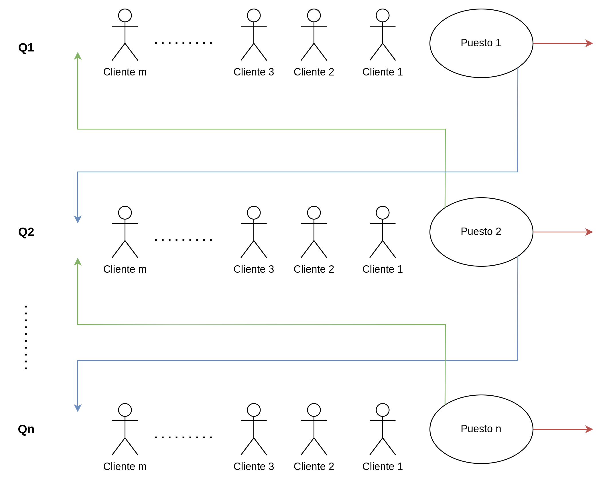
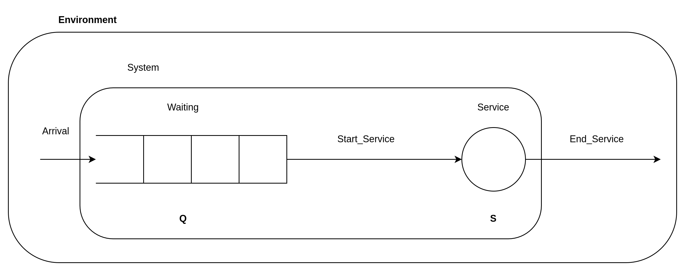
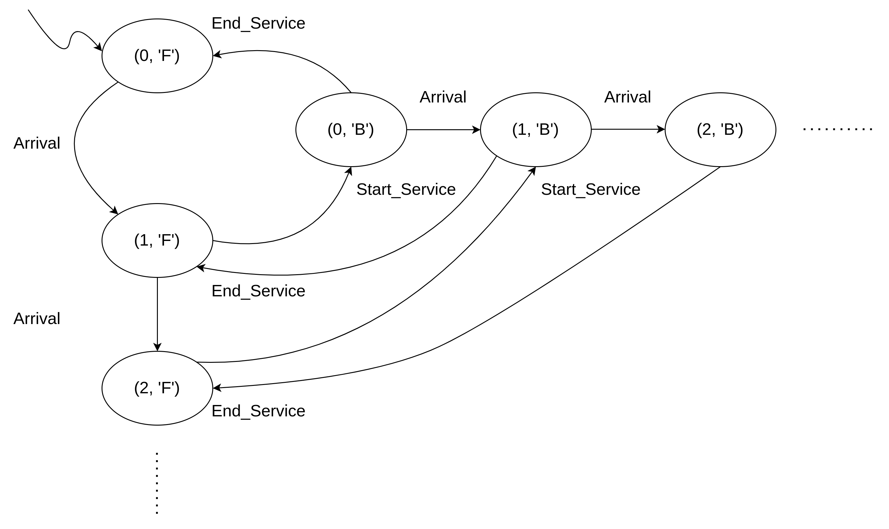
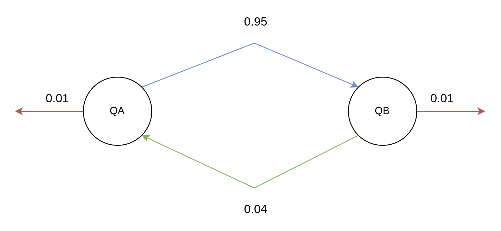
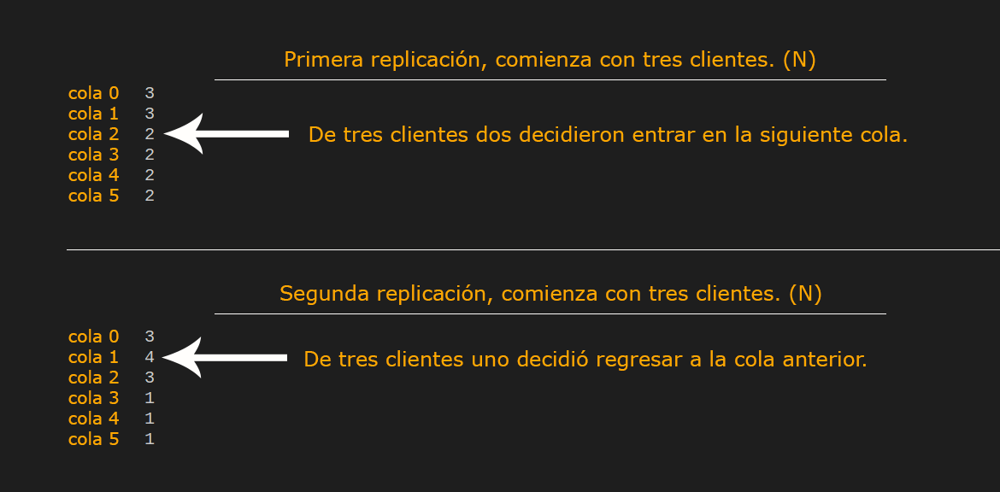
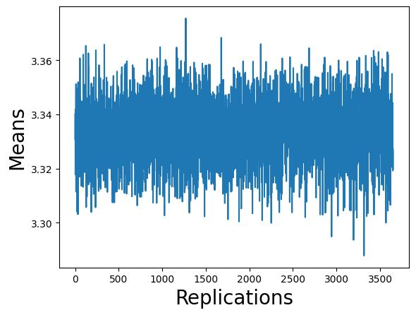

@author javiermontoya@unah.hn

@version 0.1.3

@date 2022/12/07

**I. Introducción.**
==

Este documento tiene la intención de servir como guía al lector para comprender el análisis del desarollo del proyecto final de la clase de _Teoría de la Simulación_. 

En el siguiente espacio se pretender describir el ciclo de vida de la simulación:

1. Problema.
2. Sistema.
3. Modelo.
4. Programa de computadora.
5. Análisis estadistico.
6. Resumen final.

Así mismo se incluye un diagrama de estados del proyecto. Y por último algunas anotaciones a tomar en cuenta.

<br>

<div style="page-break-after: always;"></div>

**II. Ciclo de vida de la simulación.**
==

**II.I Problema.**
--
El problema principal consiste en simular una edificación/establecimiento con una cantidad **n** de colas, además:

- Existe una probabilidad del **95%** de que un cliente (paquete) entre a la siguiente cola.

- Existe una probabilidad del **4%** de que dicho cliente regrese a la cola anterior.

- Existe una probabilidad del **1%** de que el cliente se retire del establecimiento (i.e., no vuelva a entrar a ninguna cola).

En respuesta a esto se recolectarán los tiempos de llegada y salida de cada cliente para cada cola, tomando en consideración que la diferencia de estos tiempos servirá para calcular el retraso (delay). 

**Objetivos:**

- Simular un número de n de colas.

- Almacenar las medias de retraso para cada replicación.

- Obtener los resultados estadísticos del retraso promedio, el intervalo de confianza y media poblacional.


**Preguntas:**

- ¿Cómo funcionan las probabilidades de alimentación entre las colas?

- ¿Cómo se puede controlar si se está en la cola inicial o cola final para?


<br>
<div style="page-break-after: always;"></div>

**II.II Sistema.**
--

El siguiente diagrama es una imagen mental del sistema:

<div align="center"></div>


En esta imagen mental se toma una cantidad de **n** colas (Qn), y una cantidad **m** de clientes en cada cola. Con este diagrama se pretende describir los tres principales caminos que puede tomar un cliente después de ser atendido por un "puesto", estos tres caminos son los siguientes: 
- Puede entrar a la siguiente cola.
- Puede regresar a la cola anterior.
- Por último, puede no regresar a ninguna cola (salir).

<br>
<div style="page-break-after: always;"></div>

**II.III Modelo.**
--

Luego de obtener la imagen mental se describen los elementos del modelo conceptual.

**Entidades:**

- Queue. (Dinámica)
- Stall. (Estática)
- Customer. (Dinámica)

**Atributos**

- Arrivals.
- Departures.

**Variables de estado:**

- **Q**: Número de personas en la cola. Q ∈ {0, 1, 2, ...}
- **S**: Estado del puesto. S ∈ {Free, Bussy}

**Eventos:**

- Arrival. (Llegada)
- Start_Service. (Comienzo del servicio)
- End_Service. (Fin del servicio)

**Actividades:**

- Generation. (Generación) 
- Waiting. (Espera)
- Service. (Servicio)
- Delay. (Retraso)

<br>

**Modelo conceptual:**
<div align="center"></div>

<br>
<div style="page-break-after: always;"></div>

**Diagrama de estados.**


<div align="center"></div>

En este diagrama de estado se detallan los estados por los que pasará cada una de las colas que serán simuladas. Cada puesto tendrá un estado **"Free" (F)**, que pasará a un estado **"Bussy" (B)** cuando un evento _Start_Service_ ocurra y cada cola tendrá una variable de estado con la cantidad de clientes que se encuentren en la cola en ese instante. Luego de que ocurra un evento  _End_Service_ el estado cambiará, restando una unidad a la cola, y regresando el puesto al estado free.

<br>
<div style="page-break-after: always;"></div>

**II.IV Programa de computadora.**
--

**Lluvia de ideas.**

Como idea principal, para traducir los saltos entre colas se tomó como "referencia" las cadenas de Markov de tiempo continuo (vistas en la sección 4.5 del libro principal de la clase), sabemos que cuando una cadena de Markov de tiempo continuo entra en un estado, permanece en ese estado durante una cantidad de tiempo que se distribuye _exponencialmente_. En adición a esto, una cadena de Markov que representa un proceso de cola está impulsada por dos eventos: llegada y salida. Además se pueden usar probabilidades que definirán si se pasa de un estado a otro. Para nuestra conveniencia, en lugar de cambiar entre estados usando las probabilidades, se cambiará entre una cola u otra dependiendo de las probabilidades ya definidas en el problema. Podemos visualizar el salto de colas de la siguiente manera:

<div align="center"></div>

Aquí está una ejecución del programa #1 en una fase temprana, ilustra sobre el como se pueden retratar los saltos de cola:

<div align="center"></div>

Para facilitar la explicación se ejecutaron dos replicaciones con un buffer de tres paquetes y seis colas. En la primera replicación podemos notar que de las tres personas que estaban en la cola 1 solamente dos fueron a la siguiente colas, así mismo en la segunda replicación una persona de la cola 2 regresó a la cola 1 y por lo tanto en esa cola se atendieron cuatro clientes. Esta es la forma en que se comprendió la problemática.


**Programa #1**

Con este programa se generan los archivos .tsv que serán usados en el programa #2. Para este programa se reutilizaron las clases proporcionadas por el maestro sobre el listing 8.2 del libro principal de la clase. A continuación, se hará un recorrido sobre las principales modificaciones o agregados que se usaron para desarollar el programa #1.

- _Simulation.py_:

    - Se agregó un diccionario _queues_, su proposito será almacenar la información de todas las colas. (Línea 124)

    - Una variable _aux_ que se encarga de restaurar la cantidad de clientes en cada replicación. (Línea 127)

    - Un ciclo _while_ que recorrerá la cantidad de colas, dentro de este ciclo se genera la simulación, a su vez se almacenan los datos de arrivals y departures para cada cola. (Líneas 142 — 195)

    - Se usa la función _random()_ para determinar la cantidad de clientes que van a la siguiente cola, regresan a la cola anterior o salen del sistema.
    
    - La función _run()_ ahora recibe un parámetro con la cantidad de colas a simular.

    - Se modificó la función _simulation()_, ahora recibe dos parámetros:
        
        - nCostumers: Cantidad de clientes en la cola.
        - lastTime: Último tiempo de salida en la cola, este parámetro ayudará a seguir la secuencia de tiempos cuando un cliente regrese a la cola.

    - Se agregó una nueva función _probability()_, se encarga de obtener la cantidad de clientes que cumplen con las probabilidades, esta función recibe dos parámetros:

        - probability: Probabilidad del suceso que se desea.
        - nActual: Cantidad actual de clientes.

Además, se agregó un nuevo archivo:

- _FileGenerator.py_:

    - Contiene dos métodos, el método construtor y un método para generar un archivo TSV (Tab Separated Values).

    - La función _fileGeneratorTSV()_ se encarga de generar un archivo .tsv con las medias obtenidas, esta función recibe dos parámetros:

        - name: Es el nombre del archivo junto con su extensión.
        - data: Lista con los datos que se desean almacenar en el archivo.

**Programa #2**

Este programa se encargará de de leer los resultados del programa #1, y a partir de estos resultados creará un gráfico y una salida con el retraso promedio, el intervalo de confianza y la media poblacional. A continuación se detallan sus principales clases y métodos:

- _DataManager.py_:

    - Se modificó la función _read()_, además de leer el archivo structuredData.tsv se encarga de formatearlo para obtener únicamente los retrasos de cada replicación, esta función recibe un único parámetro:

        - fileName: Nombre del archivo al que se le hará lectura.

    - Esta clase también contiene la _TSVToNumberList()_, recibe como parámetro la lista obtenida en _read()_, esta lista será retornada como una lista de flotantes.

    - Se agregaron métodos accesores y mutadores para obtener los valores de lamda y mu que serán usados para calcular la media poblacional.

- _Plot.py_:

    - Posee una función _run()_ que crea un gráfico a partir de los samples (lista que recibe como párametro) obtenidos en el archivo structuredData.

- _Result.py_:

    - Aquí está la función _results()_ que calculará el retraso promedio, el intervalo de confianza y la media poblacional, luego se instancia la clase _FileGenerator_ para almacenar estos resultados en un archivo txt. Esta función recibe los siguientes parámetros:

        - lamda: Valor usado para generar los tiempos de llegada.
        - mu: Valor usado para generar los tiempos de salida.
        - samples: Lista que contiene los retrasos de cada replicación.

- _FileGenerator.py_:

    - Contiene una función _fileGeneratorTXT_ que almacena en un archivo txt el retraso promedio, el intervalo de confianza y la media poblacional, esta función recibe dos parámetros:

        - name: Es el nombre del archivo junto con su extensión.
        - data: Lista con los datos que se desean almacenar en el archivo.

<div style="page-break-after: always;"></div>

**II.V Análisis Estadístico.**
--

Con la ejecución del programa #1 obtenemos una lista de datos sin procesar, estos datos son procesos por el programa #2 donde son procesados y convertidos en información, obteniendo un gráfico con cada media de retraso obtenida en cada replicación y una salida con la media de retraso, los intervalos de confianza y la media poblacional. A continuación, se detalla este proceso:

Para los datos obtenidos en el programa #1 se usa un lamda con un valor de 0.2 y un mu con valor 0.3 para simular los tiempos de llegada y salida respectivamente, usando el método _expovariate()_ de la librería _random_ donde lamda y mu son enviados como parámetros de este método, lo que hace este método es recibir un parámetro 1/(media deseada) y a partir de dicho parámetro entrega un valor aleatorio. Una vez obtenemos los tiempos de llegada y salida que obtiene cada cliente en cada cola se calculan los tiempos de retraso (delay) y se procede a obtener una media de retraso obtenida en cada replicación. Por último, estos datos son almacenados en un archivo structuredData.tsv por el programa #1.

Ahora el programa #2 se encarga de obtener los datos de las medias de retraso en cada replicación a partir del archivo creado por el programa #1, y con cálculos hechos en el capitulo 6 del libro de la clase se procede a procesar los datos para convertirlos en información, obteniendo de esta manera la media de retraso, los intervalos de confianza y la media poblacional.


<div style="page-break-after: always;"></div>

**II.VI Resumen final.**
--

Finalmente se obtuvieron los siguientes resultados:

```
Average Delay = 3.33
Confidence Interval: ( 3.33, 3.33 )
Population Mean = 10.0
```

También el siguiente gráfico:
<div align="center"></div>

Dando como respuesta al problema que los tiempos de retraso promedios son de 3.33, que es lo que tardaría cada cliente desde que llega y se va en cada puesto. En el gráfico podemos observas los tiempos de retraso promedio obtenidos en cada replicación.

Las alimetanciones de cola funcionan con una probabilidad y en código se tradució gracias al método _random()_ de la librería _random_ donde obtenemos valores de 0 a 1, y gracias a un condicional pudimos comprobar que se cumplieron dichas probabilidades. Y gracias también a los condicionales se puede saber si está en la cola inicial o final para saber cuándo los clientes pueden ir a la siguiente cola o regresar a una cola anterior.

        

<br>
<div style="page-break-after: always;"></div>

**III. Anotaciones.**
==

- Los diagramas (imágenes) usados en este documento están hechos con la herramienta **draw.io** vista en clase: https://app.diagrams.net/

- Se obtuvieron tiempos de ejecución muy altos para los parámetros del enunciado del proyecto.

- Investigando por otros medios, estos tiempos se pueden acortar drásticamente usando librerías externas, pero el propósito de este proyecto era usar librerías que ya están por defecto.

<br>

**IV. Bibliografía.**
==
Osais, Y. E. (2017). Computer Simulation: A Foundational Approach Using Python. Amsterdam University Press.